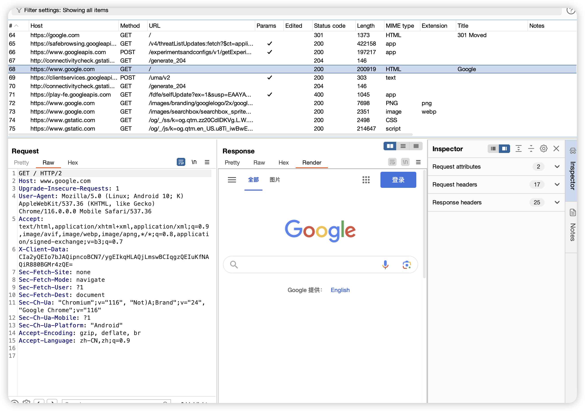

# [Move Certificate](https://github.com/ys1231/MoveCertificate)

[中文](README.md) | [Türkçe](README.tr.md)

A `Magisk/KernelSU/APatch` module for moving user certificates to system certificates. Supports `Android 7-16`.
If your phone has an official image, you might need this module. If you compile your own ROM, you can either build it in or manually move it using `remount`.

# Usage

1. After exporting the certificate, simply `push` it to your phone and install it normally through system settings, then restart. No format conversion needed.
2. Can be used with [appproxy](https://github.com/ys1231/appproxy) VPN proxy tool.

## Manual Certificate Installation to System Certificate Directory

- **This method will overwrite existing certificates, designed for multiple computers and built-in certificates**
- Normally, this scenario is not needed.

0. If the certificate has been moved before or built into the source code, you'll find that direct installation through the system doesn't actually install the certificate. This scenario needs to be preserved.

1. Export the packet capture software certificate and convert it to pem format
2. Get the certificate hash

```shell
# For pem certificates (Android system uses der, so the moved certificate needs to be converted to der)
## 1. Calculate hash
### For OpenSSL versions above 1.0
openssl x509 -inform PEM -subject_hash_old -in cacert.pem
### For OpenSSL versions below 1.0
openssl x509 -inform PEM -subject_hash -in cacert.pem
## 2. Convert to der
openssl x509 -in cacert.pem -outform der -out cacert.der
mv cacert.der 02e06844.0

# For der certificates
## 1. First convert to pem to calculate hash
openssl x509 -in cacert.der -inform der -outform pem -out cacert.pem
openssl x509 -inform PEM -subject_hash_old -in cacert.pem
## 1.1 Or directly calculate der
openssl x509 -in cacert.der -inform der -subject_hash_old -noout
## 2. Rename certificate to hash.0
mv cacert.der 02e06844.0
# Or directly extract the certificate from the user directory after phone installation, no need to worry about calculation and format conversion.
```

4. Manually rename the certificate file (before conversion) to `02e06844.0`, or coexist as `02e06844.1`
5. `adb push 02e06844.0  /data/local/tmp/cert/`
6. After pushing the certificate to the phone, restart to take effect.

# Test Results


## Star History

[](https://star-history.com/#ys1231/MoveCertificate&Date)

# References:
- http://www.zhuoyue360.com/crack/60.html
- https://topjohnwu.github.io/Magisk/guides.html#boot-scripts
- https://github.com/Magisk-Modules-Repo/movecert
- https://github.com/andyacer/movecert
- https://book.hacktricks.xyz/v/cn/mobile-pentesting/android-app-pentesting/install-burp-certificate#android-14-zhi-hou 
- https://kernelsu.org/zh_CN/guide/module.html 