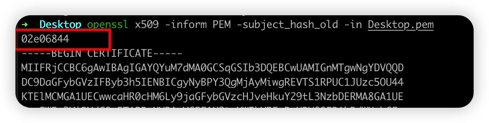
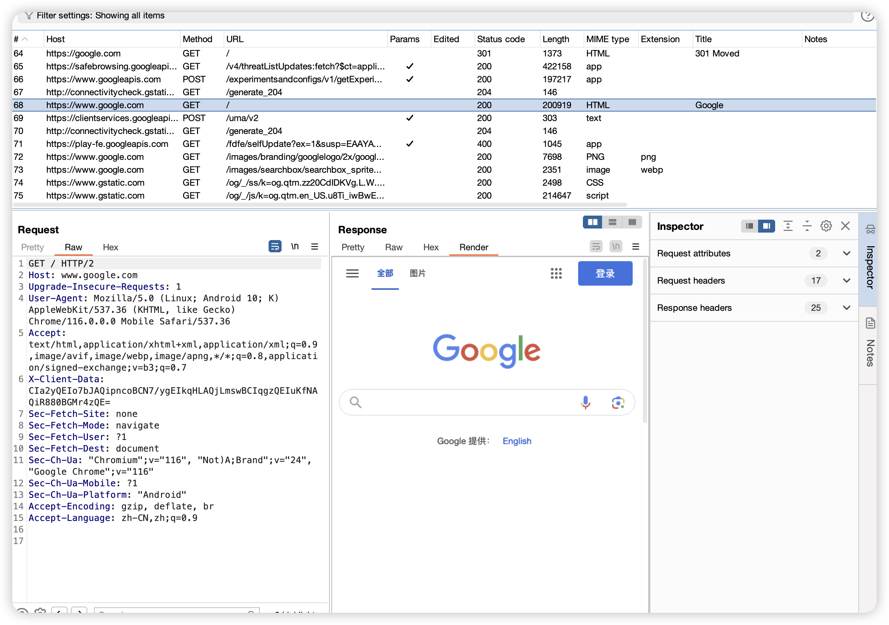

# [MoveCertificate](https://github.com/ys1231/MoveCertificate)

[中文](README.md) | [Türkçe](README.tr.md)

A `Magisk/KernelSU/APatch` module for moving user certificates to system certificates. Supports `Android 7-16`.
If your phone has an official image, you might need this module. If you compile your own ROM, you can either build it in or manually move it using `remount`.

# Usage

- Prefer installing through system settings, no need to deal with encoding issues

1. After exporting the certificate, simply `push` it to your phone and install it normally through system settings, then restart. No format conversion needed.
2. Can be used with [appproxy](https://github.com/ys1231/appproxy) VPN proxy tool.

## Manual Certificate Installation to System Certificate Directory

- **This method will overwrite existing certificates, designed for multiple computers and built-in certificates**
- Normally, this scenario is not needed.
- The HASH.0 directly exported by Reqable may not always work. It is recommended to export the crt and install it normally through system settings, or use the commands below to convert it. Otherwise, even if the certificate file is moved successfully, the system won't recognize it due to encoding issues.

0. If the certificate has been moved before or built into the source code, you'll find that direct installation through the system doesn't actually install the certificate. This scenario needs to be preserved.

1. Export the packet capture software certificate and convert it to pem format
2. Get the der certificate

```shell
# For pem certificates (Android system uses der, so the moved certificate needs to be converted to der)
## 1. Calculate hash (either one)
openssl x509 -inform PEM -subject_hash_old -in cacert.pem
openssl x509 -inform PEM -subject_hash -in cacert.pem
## 2. Convert to der
openssl x509 -in cacert.pem -outform der -out cacert.der
### Or from crt
openssl x509 -in cacert.crt -outform der -out cacert.der
mv cacert.der 02e06844.0

# For der certificates
## 1. Calculate der hash (either one)
openssl x509 -in cacert.der -inform der -subject_hash_old -noout
openssl x509 -in cacert.der -inform der -subject_hash -noout
## 2. Rename certificate to hash.0
mv cacert.der 02e06844.0
# Or directly extract the certificate from the user directory after installing it on the phone, no need to worry about calculation and format conversion.
```



3. Get the der certificate `02e06844.0`, or coexist as `02e06844.1`
4. `adb push 02e06844.0  /data/local/tmp/cert/`
5. Restart and it's done.

## MoveCertificate web

- A web page for the MoveCertificate module to display the list of installed certificates.
- It can also view detailed information about certificates installed by the module.
- Long press to delete installed certificates.

# Build Command
```shell
./buildzip.sh all
```

# Test Results


## Star History

[](https://star-history.dera.page/#ys1231/MoveCertificate&Date)

# References:
- http://www.zhuoyue360.com/crack/60.html
- https://topjohnwu.github.io/Magisk/guides.html#boot-scripts
- https://github.com/Magisk-Modules-Repo/movecert
- https://github.com/andyacer/movecert
- https://book.hacktricks.xyz/v/cn/mobile-pentesting/android-app-pentesting/install-burp-certificate#android-14-zhi-hou 
- https://kernelsu.org/zh_CN/guide/module.html 
