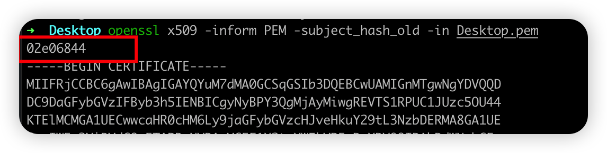

# Move Certificates

这是一个`Magisk/KernelSU/APatch`模块 用于移动用户证书到系统证书.支持`Android 7-14`
如果手机是官方镜像,可能就需要借助模块,如果是自己编译的直接内置或者`remount`手动移一下就行了.

# 使用方法

1. 导出证书后直接`push`到手机,使用系统设置正常安装证书,完了重启即可,不需要格式转换.
2. 可搭配 [appproxy](https://github.com/ys1231/appproxy) vpn代理工具.

## 手动安装证书到系统证书目录

- **此方法会覆盖已有的证书，专为多台电脑和内置证书准备**
- 正常情况下,不需要此场景.

0. 如果证书已经移动过或者内置到源码中，会发现直接通过系统安装，实际证书并没有被安装进去，需要保留这种场景

1. 导出抓包软件证书 转换 证书为 pem 格式
2. ~~`adb shell "mkdir -p  /data/local/tmp/cert"`~~
3. 获取证书hash

```shell
#openssl版本在1.0以上的版本的执行下面这一句---------------------
openssl x509 -inform PEM -subject_hash_old -in cacert.pem
#openssl版本在1.0以下的版本的执行下面这一句
openssl x509 -inform PEM -subject_hash -in cacert.pem
# 如是.der 需要先转换为pem 以burp为例
openssl x509 -in burp.der -inform der -outform pem -out burp.pem
# 如果导出的证书是pem,直接计算并修改名称,例如是.der 需要先转换为pem.
# 计算名称之后需要使用转换前的证书修改名称.(可验证md5会发现使用手机进行安装的证书md5和转换前证书md5一致)
# 或者直接使用手机安装后,提取用户目录的证书出来,就不需要考虑计算和格式转换问题.
```



4. 手动修改证书(**转换前**)文件名为`02e06844.0`,或者共存`02e06844.1`
5. ~~`mkdir /data/local/tmp/cert`  这个cert目录需要自己创建~~
6. `adb push 02e06844.0  /data/local/tmp/cert/`
7. 证书推到手机后,重启即可生效，突然发现得保留这种场景。

# 使用实测


# 参考链接:
- http://www.zhuoyue360.com/crack/60.html
- https://topjohnwu.github.io/Magisk/guides.html#boot-scripts
- https://github.com/Magisk-Modules-Repo/movecert
- https://github.com/andyacer/movecert
- https://book.hacktricks.xyz/v/cn/mobile-pentesting/android-app-pentesting/install-burp-certificate#android-14-zhi-hou 
- https://kernelsu.org/zh_CN/guide/module.html
